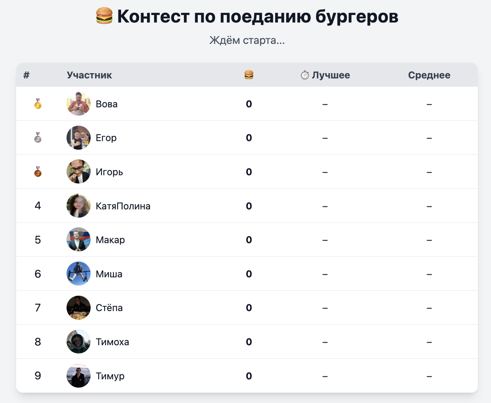

# 🍔 Контест по поеданию бургеров

[http://contest.babushkin05.ru/](http://contest.babushkin05.ru/)



## Описание

Простой конкурс по поеданию бургеров с лидербордом.  
Лидеры показываются с фотографиями, количеством съеденных бургеров, лучшим временем и средним временем на бургер.  
Также отображается общее время с начала контеста.

## Участники (ID)

- `vova` – Вова
- `misha` – Миша
- `stepa` – Стёпа
- `egor` – Егор
- `timur` – Тимур
- `kp` – КатяПолина
- `timoha` – Тимоха
- `igor` – Игорь
- `makar` – Макар

## API

### Получить список лидеров

```bash
GET /leaders
```

**Ответ:**

```json
{
  "contest_start": "2025-10-19T12:34:56.789Z",
  "leaders": [
    {
      "id": "vova",
      "name": "Вова",
      "count": 5,
      "photo": "/photos/vova.jpg",
      "best_ms": 1234,
      "avg_ms": 2345,
      "interval_count": 5,
      "last_eat": "2025-10-19T12:35:01.234Z"
    }
  ]
}
```

- `best_ms` – лучшее время на один бургер (мс)  
- `avg_ms` – среднее время на бургер (мс)  
- `interval_count` – количество интервалов (число съеденных бургеров)  
- `last_eat` – время последнего съеденного бургера в ISO8601  

---

### Все остальные запросы защищены паролем (`PASS`) из `.env`

Пример: если `PASS=mysecretpass`, все запросы будут начинаться с `/mysecretpass/...`.


### Запустить контест (обнулить всех)

```bash
POST /PASS/start
```

- Устанавливает текущее время как `contest_start`  
- Обнуляет количество бургеров у всех участников  
- Обнуляет статистику времени  

---

### Увеличить количество у участника на 1

```bash
POST /PASS/{id}/up
```

- `{id}` – ID участника  
- Увеличивает `count` на 1  
- Обновляет `last_eat`, `best_ms` и `avg_ms`  

**Пример:**

```bash
curl -X POST http://contest.babushkin05.ru/mysecretpass/vova/up
```

---

### Установить конкретное количество для участника

```bash
POST /PASS/{id}/{count}
```

- `{count}` – число бургеров  
- Не меняет статистику времени  

**Пример:**

```bash
curl -X POST http://contest.babushkin05.ru/mysecretpass/stepa/5
```

---

## Статистика

- Лидерборд сортируется по количеству съеденных бургеров  
- Первые три участника отмечаются медалями 🥇🥈🥉  
- Для каждого участника отображается:
  - Фото  
  - Количество съеденных бургеров  
  - Лучшее время на бургер (`best_ms`)  
  - Среднее время на бургер (`avg_ms`)  
  - Количество интервалов (`interval_count`)  
  - Время последнего бургера (`last_eat`)  

---

## Настройка

1. Создать файл `.env` рядом с `main.go`:

```
PASS=mysecretpass
```

2. Запустить сервер:

```bash
go run main.go
```

3. Фронтенд доступен по корню `/`:

```
http://contest.babushkin05.ru/
```
